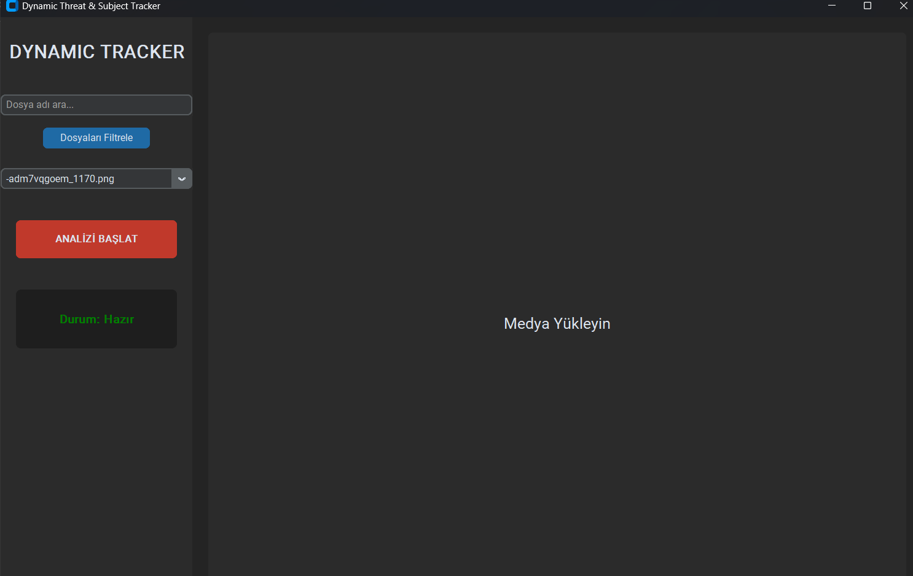
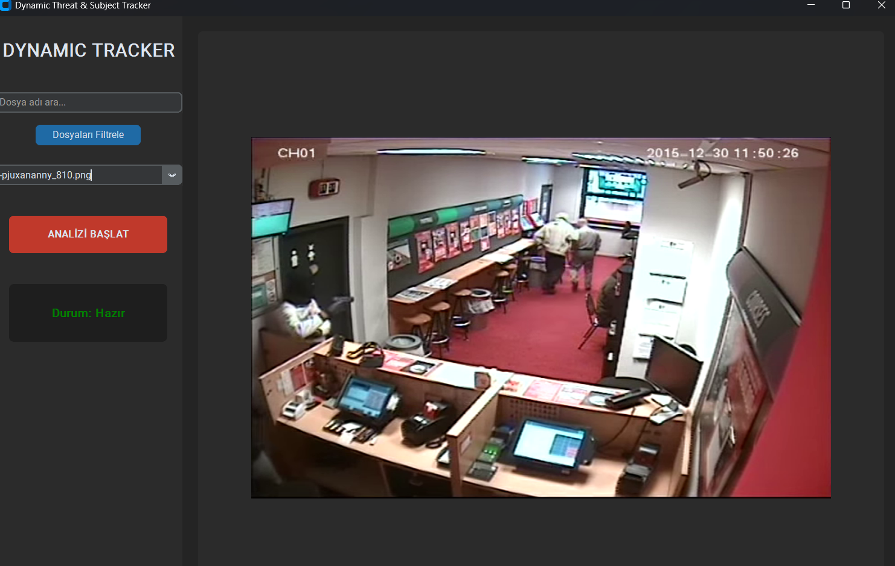
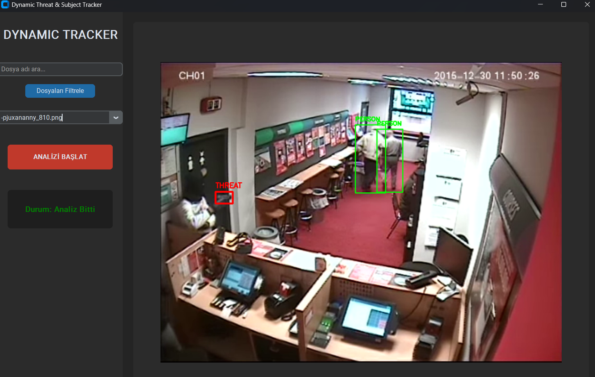
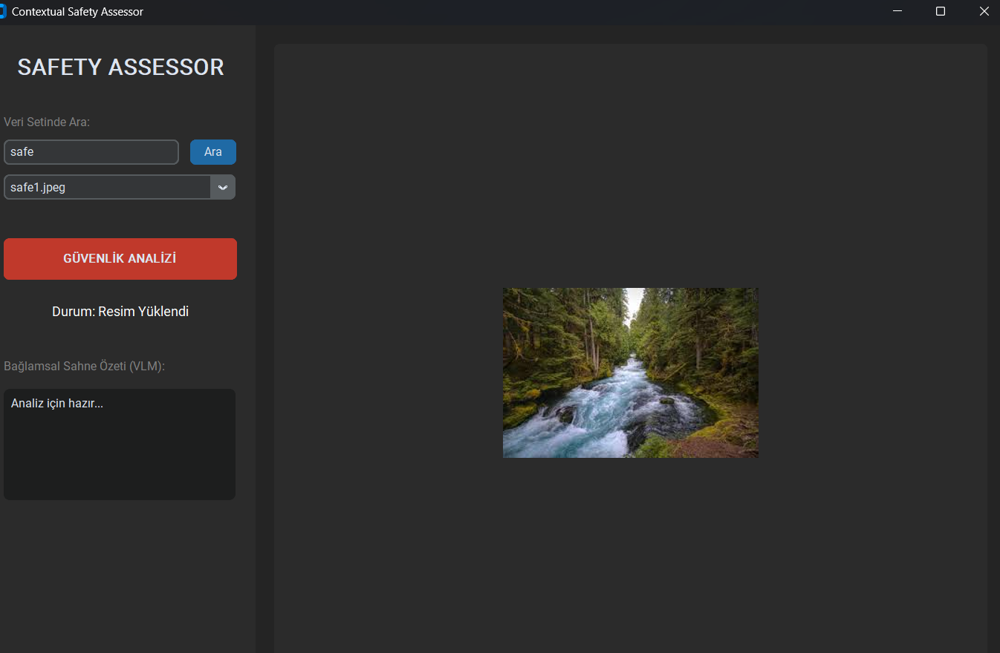
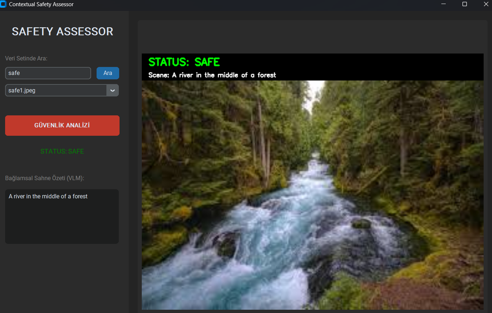
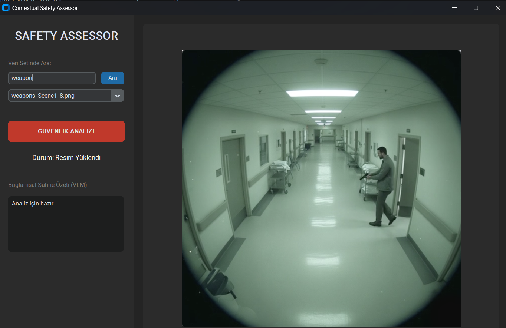
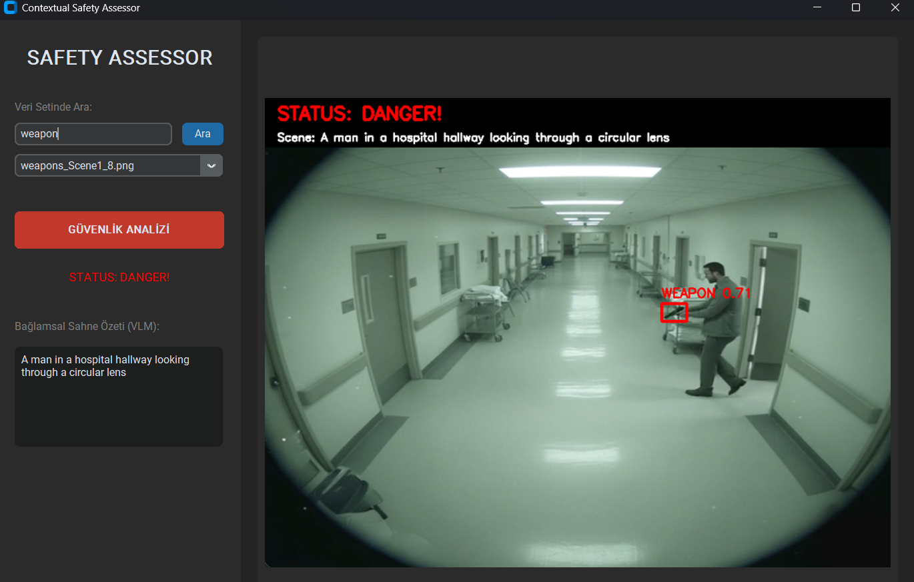

# SentinelVisionSuite

A two-stage smart AI security framework merging YOLOv8n's real-time detection speed with BLIP’s contextual depth to effectively prevent false alarms in weapon detection.










## ✨ Features

- **Real-Time Detection:** High-speed weapon identification using YOLOv8n.
- **Contextual Safety Assessment:** Evaluates the scene (SAFE/DANGER) via BLIP Vision-Language Model to filter out false positives.
- **Threat Prioritization:** Classifies threats into *Low*, *Moderate*, and *Active* levels using K-Means (k=3) clustering based on distance and confidence scores.
- **High Accuracy:** Achieves 98.44% mAP and 95.73% F1-score.
- **Low False Alarm Rate:** Reduces false positives to just 1.42% through semantic validation.
- **Custom Master Dataset:** Trained on a unified dataset of 26,014 images combined from 4 different sources.

## 🧱 Tech Stack

- **Core Vision Model:** YOLOv8n (Ultralytics)
- **Vision-Language Model:** BLIP (Salesforce / Hugging Face Transformers)
- **Machine Learning:** Scikit-learn (K-Means Algorithm)
- **Computer Vision:** OpenCV
- **Language:** Python 3.10+
- **Deep Learning Framework:** PyTorch

## 📂 Project Structure

```text
SentinelVisionSuite/
├─ Codes and Files/
│  ├─ train.py
│  ├─ dynamic_tracker.py
│  ├─ safety_assessor.py
│  ├─ convert_to_yolo.py
│  ├─ best_model.pt
│  ├─ dataset.json
│  └─ SVS_ProjectReport.pdf
├─ Master_Dataset/
│  ├─ images/ (26,000+ unzipped images)
│  └─ labels/ (YOLO format annotations)
├─ runs/
│  ├─ detect/ (YOLO training & validation logs)
│  └─ safety_assessor/ (BLIP assessment visual logs)
├─ Arge_Arsiv/
├─ images/ (README and presentation assets)
└─ .gitattributes
